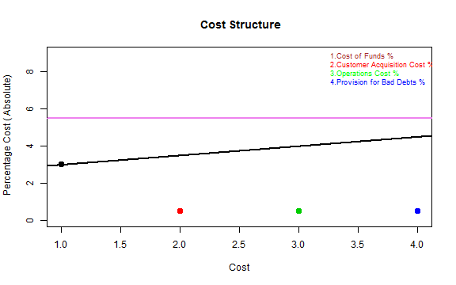

## State of the Low Income Housing Market

1. A well supported housing finance landscape and presence of companies specialized to meet the lower end of the market has helped make Housing supply accessible to low-income customers

2. These specialized housing finance companies have been able to build a quality portfolio

3. There is a tremondous built-up demand at the bottom of the pyramid and this is reflected in the high growth rates of these companies

4. These companies are now spreading to the hinterland as well and meeting in some ways the objective of financial inclusion. 

---

## Key Challenges to sustaining profitable growth

1. Access to debt is a concern with most of these companies having debt/equity ratio of 2:1 or lower

2. There is an additional issue of high cost of debt.

3. Lending rates have therefore been in the range 5-7% which are significantly higher than regular housing loans

3. Lowering the overall cost of operations can play a significant role in addressing this challenge

---

## Cost of Operations

1. Cumulative Costs is at 4.5% ( Refer Black Line)
2. Average Lending Rate ( including Processing Fee) is at 5.5% ( Refer horizontal Cyan color line)

 

---

## Proposed Solution to Key Challenge

1. Reduce Cost of Operations, Customer Acquisition Cost and Provisions for Bad Debts

2. Build model to ensure loan portfolio is healthy by limiting eligibility and with appropriate pegging of risk - interest rate

3. Build a self service model that initiates origination process on a website, having lesser intermediaries, lower marketing costs and higher reach

4. The prototype built using shiny gives a glimpse of this business model

